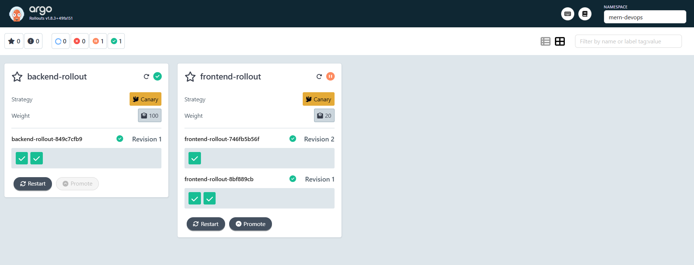
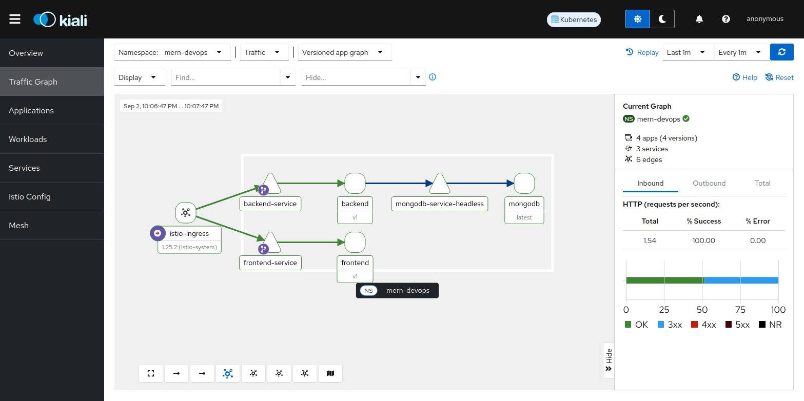
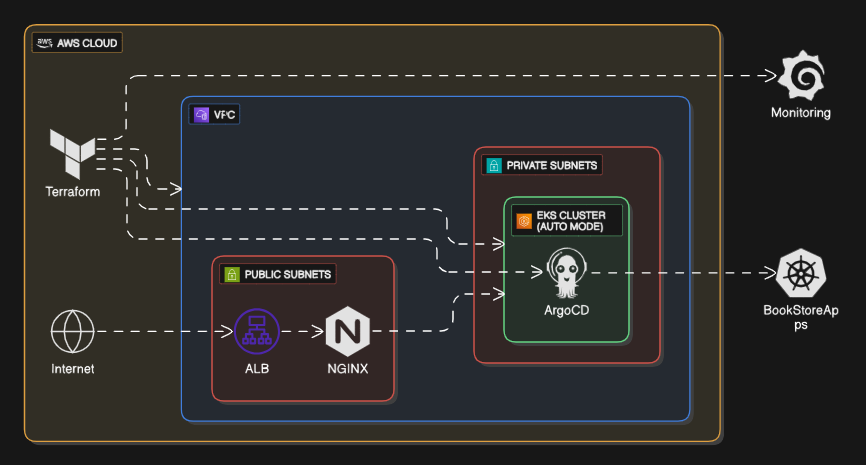

# 🚀 CloudNative DevOps Blueprint

  

*A comprehensive DevOps blueprint for deploying cloud-native applications with enterprise-grade tooling*

## 🎯 Overview

This project demonstrates a **production-ready DevOps pipeline** for deploying a MERN (MongoDB, Express, React, Node.js) application using modern cloud-native technologies and best practices. From local development to cloud deployment, this blueprint covers the entire application lifecycle.

## 🌟 Project Deployment Flow

*End-to-end deployment pipeline from code commit to production*

## 🛠️ Technology Stack

<table>
<tr>
<td align="center"><strong>🏗️ Infrastructure</strong></td>
<td align="center"><strong>🔄 CI/CD</strong></td>
<td align="center"><strong>☸️ Orchestration</strong></td>
<td align="center"><strong>📊 Monitoring</strong></td>
</tr>
<tr>
<td>
• Terraform 
• AWS EKS 
• Docker 
• NGINX Ingress
</td>
<td>
• Jenkins 
• ArgoCD 
• Argo Rollouts 
• SonarQube
</td>
<td>
• Kubernetes 
• Helm 
• Kustomize 
• Istio
</td>
<td>
• Prometheus 
• Grafana 
• AlertManager 
• Custom Metrics
</td>
</tr>
</table>

## 📚 Documentation Hub

### 🐳 **Containerization**

<table border="1" cellpadding="15" cellspacing="0" style="border-collapse: collapse; width: 100%; border: 2px solid #284cdfff;">
<tr>
<td width="30%" style="border: 2px solid #284cdfff; padding: 20px ; vertical-align: top;">

**[Docker.md](./docs/Docker.md)**  
*Build and run containers with Docker Compose for multi-service applications*
- Multi-stage Dockerfiles
- Production optimizations
- Container networking
- Volume management

</td>
<td width="60%" style="border: 2px solid #284cdfff; margin-left:20px ; padding: 15px; vertical-align: middle; text-align: center;">

</td>
</tr>
</table>

### 🎯 **Advanced Deployment**

<table border="1" cellpadding="15" cellspacing="0" style="border-collapse: collapse; width: 100%; border: 2px solid #23ce26ff;">
<tr>
<td width="25%" style="border: 2px solid #23ce26ff; padding: 15px; vertical-align: top;">

#### ☸️ **Kubernetes (Local)**
**[Kubernetes.md](./docs/Kubernetes.md)**  
*Deploy on kind cluster with ingress*
- Persistent storage setup
- Demonset and Statefulset Deployments
- Load balancing
- Health checks

</td>
<td width="25%" style="border: 2px solid #23ce26ff; padding: 15px; vertical-align: top;">

#### 🔄 **CI/CD Pipeline**
**[Jenkins.md](./docs/Jenkins.md)**  
*Automated build, test, and deployment*
- Multi-stage pipeline
- Security scanning
- Quality gates
- Notification system

</td>
<td width="25%" style="border: 2px solid #23ce26ff; padding: 15px; vertical-align: top;">

#### 📦 **Package Management**
**[Helm.md](./docs/Helm.md)**  
*Template-based Kubernetes deployments*
- Chart customization
- Values management
- Release lifecycle

</td>
<td width="25%" style="border: 2px solid #23ce26ff; padding: 15px; vertical-align: top;">

#### 🔧 **Multi Env Management**
**[Kustomize.md](./docs/Kustomize.md)**  
*Environment-specific configurations*
- Base and overlay patterns
- Patch management
- Multi-environment deployment

</td>
</tr>
</table>

### 📈 **Monitoring & Alerting**

<table border="1" cellpadding="15" cellspacing="0" style="border-collapse: collapse; width: 100%; border: 2px solid #bc2323ff;">
<tr>
<td width="30%" style="border: 2px solid #bc2323ff; padding: 20px ; vertical-align: top;">

<!-- #### 📈 **Monitoring & Alerting** -->
**[Observability.md](./docs/Observability.md)**  
*Comprehensive monitoring with Prometheus & Grafana*
- Custom dashboards
- Alert rules
- Performance metrics
- Log aggregation  

</td>
<td width="60%" style="border: 2px solid #bc2323ff; margin-left:20px ; padding: 15px; vertical-align: middle; text-align: center;">

</td>
</tr>
</table>

### 🚀 **GitOps Deployment**

<table border="1" cellpadding="15" cellspacing="0" style="border-collapse: collapse; width: 100%; border: 2px solid #c9772bff;">
<tr>
<td width="30%" style="border: 2px solid #c9772bff; padding: 20px ; vertical-align: top;">

**[ArgoCD.md](./docs/ArgoCD.md)**  
*Continuous deployment with Git sync and automated application lifecycle management*
- Repository connection
- Application management
- Sync policies   
- Multi-cluster deployment
- RBAC integration

</td>
<td width="60%" style="border: 2px solid #c9772bff; margin-left:20px ; padding: 15px; vertical-align: middle; text-align: center;">

</td>
</tr>
</table>

### 🎯 **Progressive Delivery**

<table border="1" cellpadding="15" cellspacing="0" style="border-collapse: collapse; width: 100%; border: 2px solid #c9772bff;">
<tr>
<td width="30%" style="border: 2px solid #c9772bff; padding: 20px ; vertical-align: top;">

**[ArgoRollouts.md](./docs/ArgoRollouts.md)**  
*Canary deployments with automated rollbacks*
- Traffic splitting
- Analysis templates
- Rollback strategies  

</td>
<td width="60%" style="border: 2px solid #c9772bff; margin-left:20px ; padding: 15px; vertical-align: middle; text-align: center;">

</td>
</tr>
</table>

### 🕸️ **Service Mesh**  

<table border="1" cellpadding="15" cellspacing="0" style="border-collapse: collapse; width: 100%; border: 2px solid #4297ccff;">
<tr>
<td width="30%" style="border: 2px solid #42a4bcff; padding: 20px ; vertical-align: top;">

**[Istio.md](./docs/Istio.md)**  
*Advanced traffic management and security with service mesh capabilities*  
- mTLS encryption  
- Traffic splitting & canary  
- Observability & tracing  
- Policy enforcement   

</td>
<td width="60%" style="border: 2px solid #42a4bcff; margin-left:20px ; padding: 15px; vertical-align: middle; text-align: center;">

</td>
</tr>
</table>

### ☁︎ **Production Deployment**

<table border="1" cellpadding="15" cellspacing="0" style="border-collapse: collapse; width: 100%; border: 2px solid #7B42BC;">
<tr>
<td width="30%" style="border: 2px solid #7B42BC; padding: 20px ; vertical-align: top;">

#### 🏗️ **Cloud Infrastructure**
**[Terraform.md](./docs/Terraform.md)**  
*Provision and Deploy on AWS EKS cluster with IaC*

- VPC and networking setup
- EKS cluster configuration  
- Security groups and IAM
- Add-ons installation

</td>
<td width="60%" style="border: 2px solid #7B42BC; margin-left:20px ; padding: 15px; vertical-align: middle; text-align: center;">

</td>
</tr>
</table>

<!-- ## 🤝 Contributing

We welcome contributions! Please see our [Contributing Guidelines](CONTRIBUTING.md) for details. -->

## 📄 License

This project is licensed under the MIT License - see the [LICENSE](LICENSE) file for details.

---

**⭐ Star this repository if you find it helpful!**

<!-- *Built with ❤️ for the DevOps community* -->

