# Argo Rollouts: Progressive Canary Deployments in Kubernetes

Argo Rollouts is a Kubernetes controller that enables advanced deployment strategies such as canary deployments, allowing you to **progressively** release application updates with greater safety and control.

## What are Canary Deployments?

Canary deployments allow you to:
- **Gradually shift traffic** from the stable version to a new version
- **Minimize risk** by testing new versions with a small percentage of users
- **Automated rollback** if issues are detected
- **Manual control** over deployment progression
- **Real-time monitoring** of deployment health

## Prerequisites

- Kubernetes cluster (Kind, Minikube, or any K8s cluster)
- kubectl configured to access your cluster
- NGINX Ingress Controller (for traffic routing)

## 1. Installation

### Step 1: Install Argo Rollouts Controller

Create the Argo Rollouts namespace and install the controller:

```bash
kubectl create namespace argo-rollouts
kubectl apply -n argo-rollouts -f https://github.com/argoproj/argo-rollouts/releases/latest/download/install.yaml
```

### Step 2: Install CRDs

Apply the Custom Resource Definitions:

```bash
kubectl apply -k https://github.com/argoproj/argo-rollouts/manifests/crds\?ref\=stable
```

### Step 3: Install Argo Rollouts kubectl Plugin

Download and install the kubectl plugin for managing rollouts:

```bash
# Download the binary
curl -LO https://github.com/argoproj/argo-rollouts/releases/latest/download/kubectl-argo-rollouts-linux-amd64

# Make it executable
chmod +x ./kubectl-argo-rollouts-linux-amd64

# Move to PATH
sudo mv ./kubectl-argo-rollouts-linux-amd64 /usr/local/bin/kubectl-argo-rollouts

# Verify installation
kubectl argo rollouts version
```

### Step 4: Verify Installation

Check if Argo Rollouts controller is running:

```bash
kubectl get pods -n argo-rollouts
```

## 2. Setup Prerequisites

### Step 1: Install NGINX Ingress Controller

Deploy NGINX Ingress Controller for traffic routing:

```bash
kubectl apply -f https://kind.sigs.k8s.io/examples/ingress/deploy-ingress-nginx.yaml

# Wait for the controller to be ready
kubectl wait --namespace ingress-nginx \
  --for=condition=ready pod \
  --selector=app.kubernetes.io/component=controller \
  --timeout=90s

# Verify installation
kubectl get pods --namespace ingress-nginx
```

### Step 2: Create Application Namespace

Create a dedicated namespace for your application:

```bash
kubectl create namespace mern-devops
```

Switch to the argo-rollouts directory:

```bash
cd argo-rollouts/
```

## 3. Deploy Application Components

### Step 1: Deploy MongoDB

Deploy the database layer:

```bash
kubectl apply -f mongodb.yml
```

Verify MongoDB deployment:

```bash
kubectl get pods -n mern-devops -l app=mongodb
```

### Step 2: Deploy Canary Services

Create stable and canary services for both frontend and backend:

```bash
kubectl apply -f backend-services.yml
kubectl apply -f frontend-services.yml
```

Verify services:

```bash
kubectl get svc -n mern-devops
```

### Step 3: Configure Ingress for Traffic Routing

Apply the ingress configuration:

```bash
kubectl apply -f ingress.yml
```

Verify ingress:

```bash
kubectl get ingress -n mern-devops
```

## 4. Deploy Canary Rollouts

### Step 1: Deploy Backend Canary Rollout

Deploy the backend with canary deployment strategy:

```bash
kubectl apply -f backend-rollout.yml
```

### Step 2: Deploy Frontend Canary Rollout

Deploy the frontend with canary deployment strategy:

```bash
kubectl apply -f frontend-rollout.yml
```

### Step 3: Verify Rollouts

Check the status of your rollouts:

```bash
kubectl argo rollouts list rollouts -n mern-devops
kubectl argo rollouts get rollout backend-rollout -n mern-devops
kubectl argo rollouts get rollout frontend-rollout -n mern-devops
```

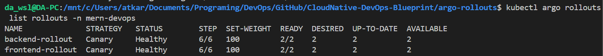

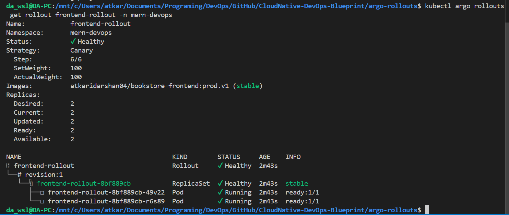

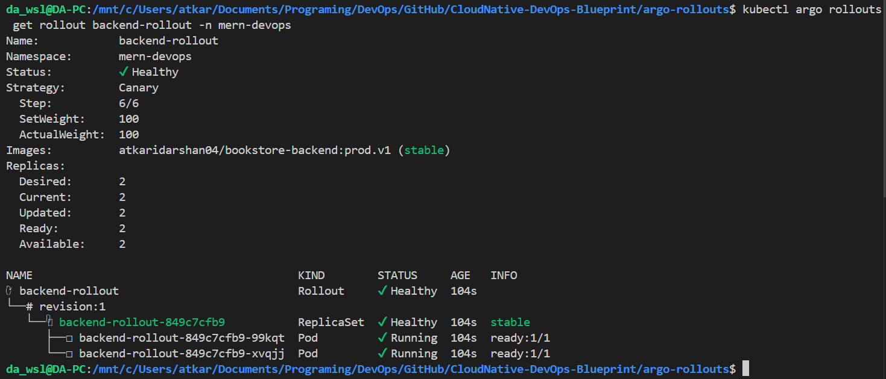


### Access Application
Head to [localhost](http://localhost) in browser to view application.
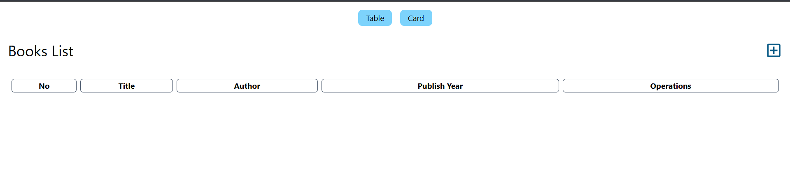

### Open Argo Rollouts dashboard
```bash
kubectl argo rollouts dashboard
```
Head with the link provided.

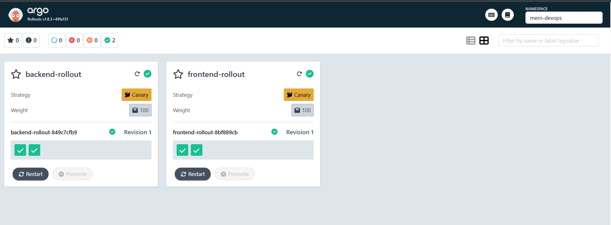
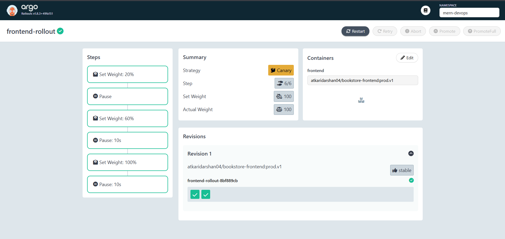


## 5. Understanding Canary Configuration

### Canary Strategy Breakdown

Our rollouts use this canary configuration:

```yaml
strategy:
  canary:
    canaryService: frontend-service-canary    # Service for canary pods
    stableService: frontend-service-stable    # Service for stable pods
    trafficRouting:
      nginx:
        stableIngress: rollout-nginx-stable  # Ingress for traffic routing
    steps:
    - setWeight: 20                          # Route 20% traffic to canary
    - pause: {}                              # Manual intervention step
    - setWeight: 60                          # Route 60% traffic to canary
    - pause: { duration: 10s }               # Wait 10 seconds
    - setWeight: 100                         # Route 100% traffic to canary
    - pause: { duration: 10s }               # Wait 10 seconds before completion
```

### Traffic Flow During Canary Deployment

1. **Initial State**: 100% traffic → Stable version
2. **Step 1**: 20% traffic → Canary, 80% → Stable (Manual pause)
3. **Step 2**: 60% traffic → Canary, 40% → Stable (10s pause)
4. **Step 3**: 100% traffic → Canary (10s pause)
5. **Completion**: Canary becomes new stable version

## 6. Canary Deployment Commands

### Trigger a Canary Deployment

Update the image to start a canary deployment:

```bash
# Update frontend image
kubectl argo rollouts set image frontend-rollout frontend=atkaridarshan04/bookstore-frontend:prod.v2 -n mern-devops

# Update backend image
kubectl argo rollouts set image backend-rollout backend=atkaridarshan04/bookstore-backend:prod.v2 -n mern-devops
```

### Monitor Canary Progress

```bash
# Watch rollout progress in real-time
kubectl argo rollouts get rollout frontend-rollout -n mern-devops --watch
```

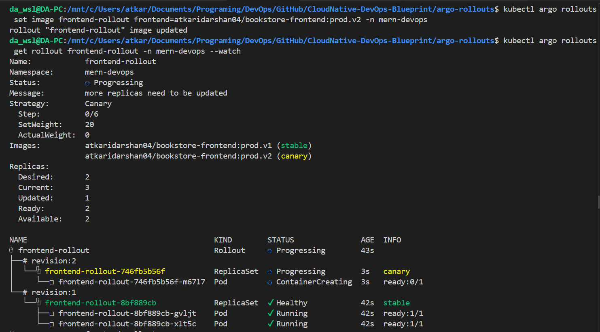


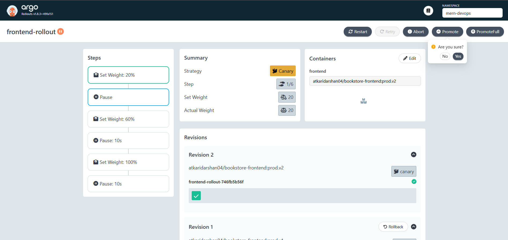
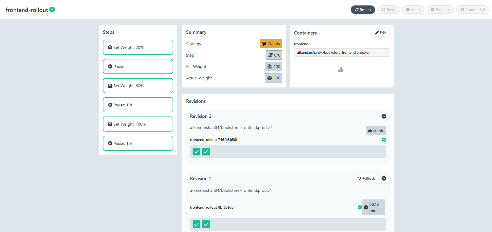

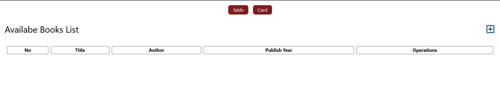

### Control Canary Deployment (via Commands)

```bash
# Promote to next step (when paused)
kubectl argo rollouts promote frontend-rollout -n mern-devops

# Abort canary deployment
kubectl argo rollouts abort frontend-rollout -n mern-devops

# Retry failed rollout
kubectl argo rollouts retry frontend-rollout -n mern-devops

# Restart rollout
kubectl argo rollouts restart frontend-rollout -n mern-devops
```

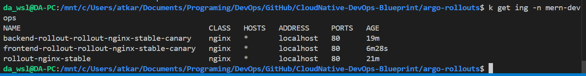

---