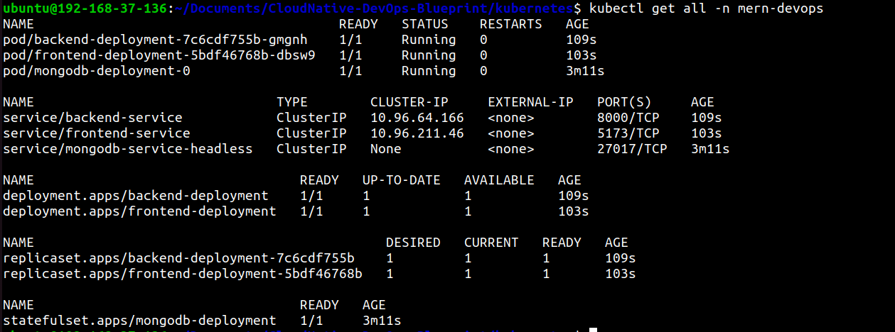

#  📦 Packaging & Deploying Applications with Helm Charts

## Step 1: Cluster Setup

Cluster Configuration: `kind-config.yaml`
```yaml
kind: Cluster
apiVersion: kind.x-k8s.io/v1alpha4
nodes:
  - role: control-plane
    extraPortMappings:
      - containerPort: 80   # for nginx ingress
        hostPort: 80
        protocol: TCP
      - containerPort: 31000 # for frontend container
        hostPort: 31000
        protocol: TCP
      - containerPort: 31100 # for backend container
        hostPort: 31100
        protocol: TCP
```

- Run the following command to create a Kubernetes cluster using the provided `kind-config.yaml`:

  ```bash
  kind create cluster --config kind-config.yaml
  ```

- Create **mern-devops** namespace:

  ```bash
  kubectl create namespace mern-devops
  ```


## Step 2: Package the Helm Charts

```bash
helm package helm-chart
```

This will create `.tgz` files for each chart in the current directory.


## Step 3: Install the Helm Charts

Install each chart using Helm:

```bash
helm install helm-chart ./helm-chart
```

### Verify

List all Helm releases to confirm they are deployed:

```bash
helm ls -n
```


Check the status of all resources in the Kubernetes cluster:

```bash
kubectl get all -n mern-devops
```



## Step 4: Configure Ingress

Deploy the Ingress controller:

```bash
kubectl apply -f https://kind.sigs.k8s.io/examples/ingress/deploy-ingress-nginx.yaml
```

Wait for the Ingress controller pods to become ready:

```bash
kubectl wait --namespace ingress-nginx \
  --for=condition=ready pod \
  --selector=app.kubernetes.io/component=controller \
  --timeout=90s
```

Verify the Ingress controller is running:

```bash
kubectl get pods --namespace ingress-nginx
```


Repackage and reinstall the chart:

```bash
helm package helm-chart
helm install helm-chart ./helm-chart
```

Access the application at:

```
http://<node-ip>
```


## Step 5: Cleanup

If you need to uninstall the deployed Helm charts, use the following commands:

### Uninstall Chart

```bash
helm uninstall helm-chart
```

After uninstalling the charts, you can also check the status to confirm that the resources have been removed:

```bash
kubectl get ns
```

List all Helm releases to confirm they are uninstalled:

```bash
helm ls
```

---

