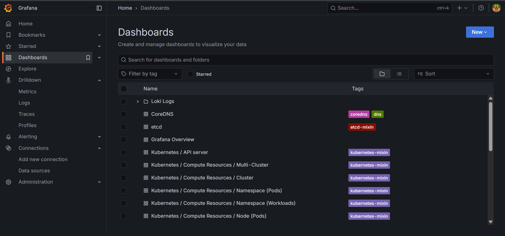

# 📊 Monitoring & Observability

This guide covers setting up comprehensive monitoring for your Kubernetes cluster using Prometheus and Grafana stack.

## 🎯 Overview

The monitoring stack includes:
- **Prometheus**: Metrics collection and storage
- **Grafana**: Visualization and dashboards
- **Node Exporter**: System metrics
- **Kube State Metrics**: Kubernetes object metrics

## 🚀 Quick Start

### 1. Cluster Setup

Create a kind cluster with monitoring port mappings:

**`kind-config.yaml`**
```yaml
kind: Cluster
apiVersion: kind.x-k8s.io/v1alpha4
nodes:
- role: control-plane
  extraPortMappings:
  - containerPort: 80    # nginx ingress
    hostPort: 80
    protocol: TCP
  - containerPort: 443   # nginx ingress (TLS)
    hostPort: 443
    protocol: TCP
  - containerPort: 30002 # prometheus
    hostPort: 30002
    protocol: TCP
  - containerPort: 30003 # grafana
    hostPort: 30003
    protocol: TCP
```

```bash
kind create cluster --config kind-config.yaml
```

### 2. Helm Configuration

**`monitoring-values.yml`**
```yaml
# Disable AlertManager for simplicity
alertmanager:
  enabled: false

# Prometheus configuration
prometheus:
  prometheusSpec:
    service:
      type: LoadBalancer
    storageSpec:
      volumeClaimTemplate:
        spec:
          storageClassName: standard
          accessModes:
            - ReadWriteOnce
          resources:
            requests:
              storage: 5Gi

# Grafana configuration
grafana:
  enabled: true
  service:
    type: LoadBalancer
  adminUser: admin
  adminPassword: password

# Node Exporter for system metrics
nodeExporter:
  service:
    type: LoadBalancer

# Kubernetes state metrics
kubeStateMetrics:
  enabled: true
  service:
    type: LoadBalancer

# Additional scrape configurations
additionalScrapeConfigs:
  - job_name: node-exporter
    static_configs:
      - targets:
          - node-exporter:9100
  - job_name: kube-state-metrics
    static_configs:
      - targets:
          - kube-state-metrics:8080
```

### 3. Installation

```bash
# Create monitoring namespace
kubectl create namespace monitoring

# Add Prometheus Helm repository
helm repo add prometheus-community https://prometheus-community.github.io/helm-charts
helm repo update

# Install monitoring stack
helm install monitoring prometheus-community/kube-prometheus-stack \
  -f monitoring-values.yml \
  -n monitoring

# Expose Prometheus via NodePort
kubectl patch svc monitoring-kube-prometheus-prometheus -n monitoring \
  -p '{"spec": {"type": "NodePort", "ports": [{"port": 9090, "targetPort": 9090, "nodePort": 30002}]}}'

# Expose Grafana via NodePort
kubectl patch svc monitoring-grafana -n monitoring \
  -p '{"spec": {"type": "NodePort", "ports": [{"port": 80, "targetPort": 3000, "nodePort": 30003}]}}'
```

## 🔍 Accessing Services

### Prometheus

Access Prometheus at: **[http://localhost:30002](http://localhost:30002)**

**Features:**
- Query metrics using PromQL
- View targets and service discovery
- Configure alerting rules


### Grafana

Access Grafana at: **[http://localhost:30003](http://localhost:30003)**

**Default Credentials:**
- **Username**: `admin`
- **Password**: `password`

**Pre-configured Dashboards:**
- Kubernetes cluster overview
- Node metrics
- Pod performance
- Application metrics




<!-- ## 📈 Key Metrics

### Cluster Metrics
- CPU and memory usage
- Pod status and health
- Network traffic
- Storage utilization

### Application Metrics
- Request rates and latency
- Error rates
- Custom business metrics
- Performance indicators -->

<!-- ## 🔧 Customization

### Adding Custom Dashboards
1. Import dashboard JSON from Grafana community
2. Create custom panels for specific metrics
3. Configure alerts and notifications

### Extending Monitoring
- Add custom ServiceMonitor resources
- Configure additional exporters
- Set up log aggregation with Loki
 -->
