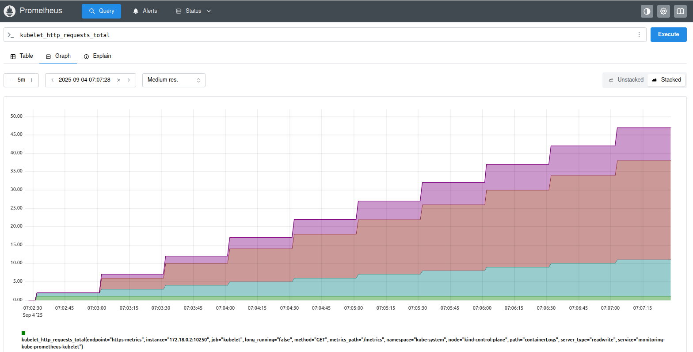
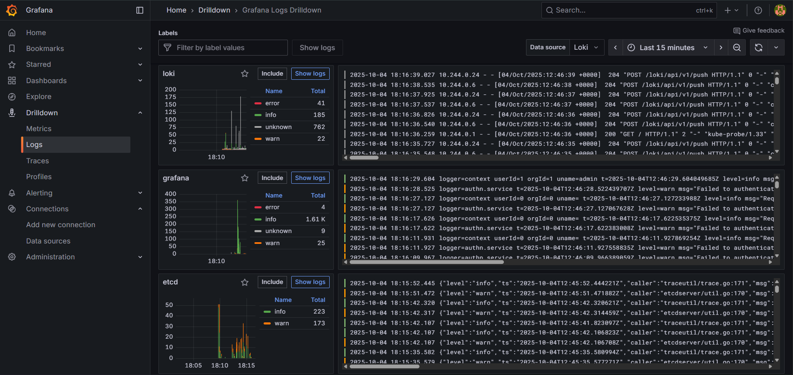
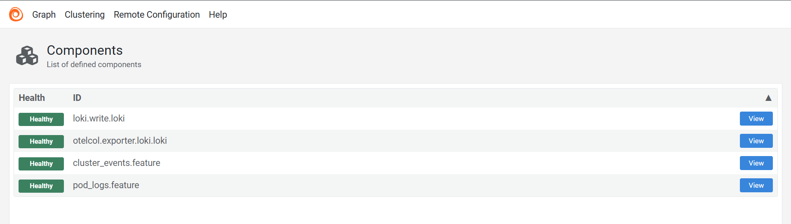

# 📊 Observability Stack: Monitoring & Logging

Complete observability setup for Kubernetes with Prometheus, Grafana, Loki, and Alloy.

## 🎯 Components

**Monitoring:**
- **Prometheus** - Metrics collection & storage
- **Grafana** - Visualization & dashboards
- **Node Exporter** - System metrics
- **Kube State Metrics** - Kubernetes metrics

**Logging:**
- **Loki** - Log aggregation & storage
- **Alloy** - Log collection & forwarding

## 🚀 Setup

### 1. Cluster Configuration

**kind-config.yaml**
```yaml
kind: Cluster
apiVersion: kind.x-k8s.io/v1alpha4
nodes:
  - role: control-plane
    extraPortMappings:
      - containerPort: 80
        hostPort: 80
        protocol: TCP
      - containerPort: 30002 # prometheus
        hostPort: 30002
        protocol: TCP
      - containerPort: 30003 # grafana
        hostPort: 30003
        protocol: TCP
      - containerPort: 30004 # loki
        hostPort: 30004
        protocol: TCP
```

```bash
kind create cluster --config kind-config.yaml
```

### 2. Install Stack

```bash
kubectl create namespace observability

# Add repositories
helm repo add prometheus-community https://prometheus-community.github.io/helm-charts
helm repo add grafana https://grafana.github.io/helm-charts
helm repo update

# Install components
helm install loki grafana/loki -f ./observability/loki-values.yml -n observability
helm install monitoring prometheus-community/kube-prometheus-stack -f ./observability/monitoring-values.yml -n observability
helm install alloy grafana/k8s-monitoring --values ./observability/alloy-values.yml -n observability
```

### 3. Expose Services

```bash
# Prometheus
kubectl patch svc monitoring-kube-prometheus-prometheus -n observability \
  -p '{"spec": {"type": "NodePort", "ports": [{"port": 9090, "targetPort": 9090, "nodePort": 30002}]}}'

# Grafana
kubectl patch svc monitoring-grafana -n observability \
  -p '{"spec": {"type": "NodePort", "ports": [{"port": 80, "targetPort": 3000, "nodePort": 30003}]}}'

# Loki
kubectl patch svc loki -n observability \
  -p '{"spec": {"type": "NodePort", "ports":[{"port":3100,"targetPort":3100,"nodePort":30004}]}}'

# Alloy (port-forward)
kubectl port-forward daemonset/alloy-alloy-logs 12345:12345 -n observability
```

## 🔗 Access URLs

- **Prometheus:** [http://localhost:30002](http://localhost:30002)
- **Grafana:** [http://localhost:30003](http://localhost:30003) - `admin/password`
- **Loki:** [http://localhost:30004/ready](http://localhost:30004/ready)
- **Alloy:** [http://localhost:12345](http://localhost:12345)

## 📈 Prometheus

Query metrics using PromQL, view targets, and configure alerts.




## 📊 Grafana

Pre-configured dashboards for cluster overview, node metrics, pod performance etc.


### Drilldown




## Loki


## 🔄 Alloy

Collects logs from containers, system logs, and Kubernetes events.




## 🎨 Dashboards

### Monitoring


### Logging


