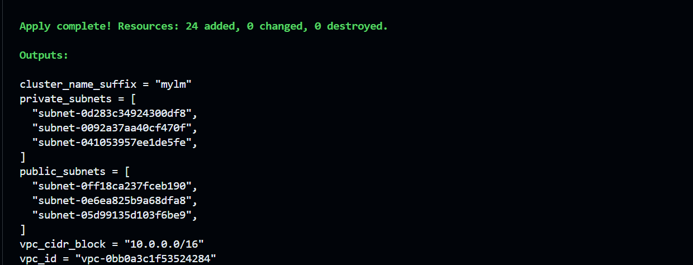
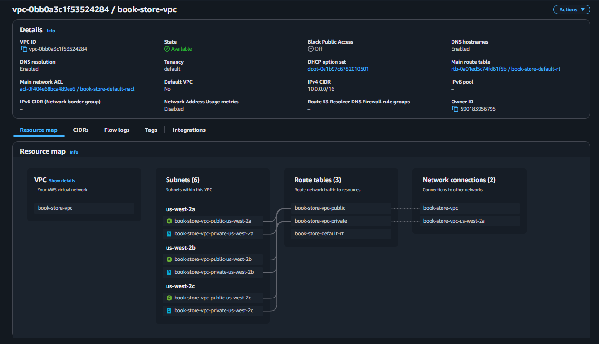
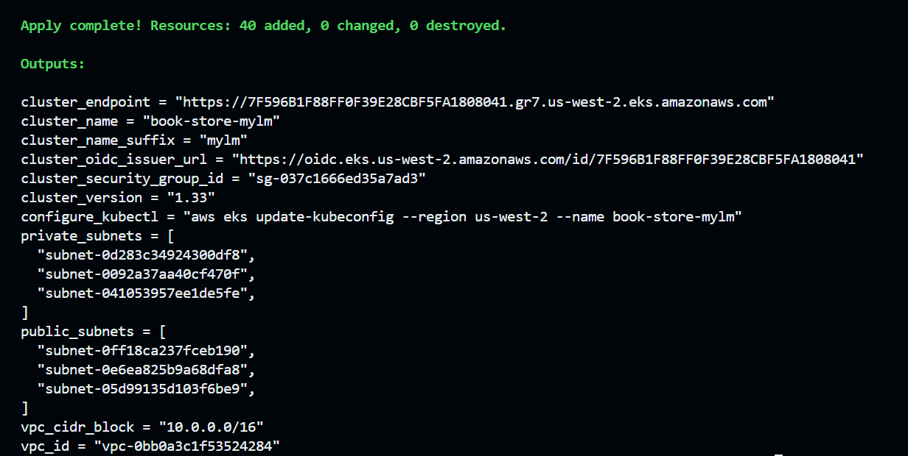
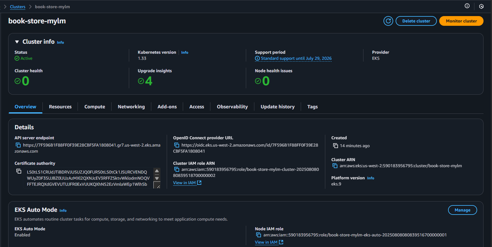
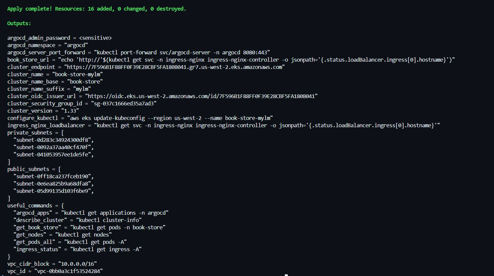
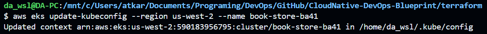
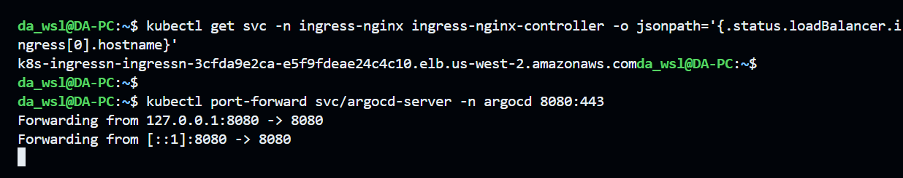
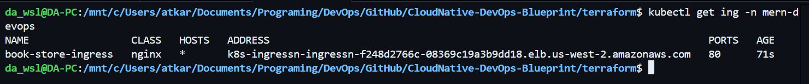
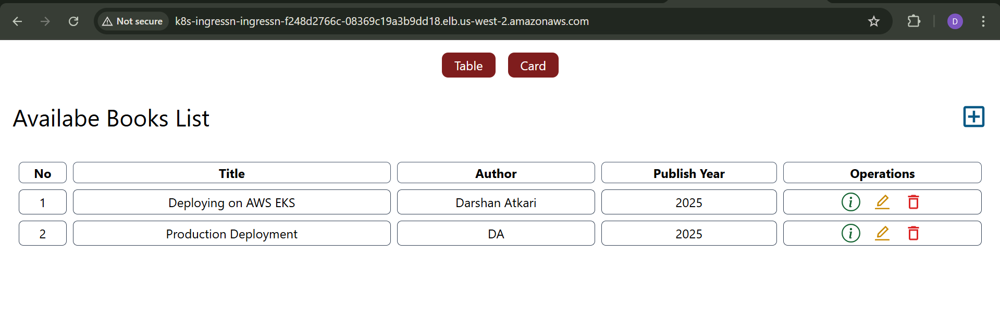

# 🏗️ Deploying Application on AWS EKS with Terraform

This guide contains the Terraform configuration for deploying the Book store application infrastructure on AWS EKS.

## Terraform Architecture


## 🚀 Quick Start

### 1. Prerequisites

- AWS CLI configured with appropriate credentials
- Terraform >= 1.0 installed
- kubectl installed

### 2. Configuration

```bash
# Copy the example variables file
cp terraform.tfvars.example terraform.tfvars

# Edit the variables file with your preferred settings
vim terraform.tfvars
```

**Note**: The cluster name will automatically have a random 4-character suffix added (e.g., `book-store-mylm`) to prevent resource conflicts and ensure uniqueness.

### 3. Deploy Infrastructure

You can deploy in 3 phases for better control:

#### Phase 1: Deploy VPC Only
```bash
# Initialize Terraform
terraform init

# Deploy only the VPC
terraform apply -target=module.vpc --auto-approve
```



#### Phase 2: Deploy EKS Cluster Only
```bash
terraform apply -target=module.book_app_eks --auto-approve
```



#### Phase 3: Deploy Add-ons and ArgoCD
```bash
# Deploy the remaining components
terraform apply --auto-approve
```


#### Single Phase Deployment (Alternative)
```bash
# Initialize Terraform
terraform init

# Review the plan
terraform plan

# Apply the complete configuration
terraform apply
```

### 4. Configure kubectl

```bash
# Update kubeconfig (replace with your region and cluster name)
aws eks update-kubeconfig --region <region> --name <cluster-name>
```
> e.g: aws eks update-kubeconfig --region us-west-2 --name book-store-mylm
<!--  -->

### 5. Access ArgoCD

```bash
# Get ArgoCD admin password
kubectl -n argocd get secret argocd-initial-admin-secret -o jsonpath='{.data.password}' | base64 -d

# Port-forward to ArgoCD server
kubectl port-forward svc/argocd-server -n argocd 8080:443

# Open browser to https://localhost:8080
# Username: admin
# Password: (from step 1)
```



## 📋 What Gets Deployed

### Core Infrastructure
- **VPC** with public and private subnets across 3 AZs
- **EKS Cluster** with Auto Mode enabled
- **Security Groups** with appropriate rules

### Add-ons
- **NGINX Ingress Controller** for load balancing
- **Cert Manager** for SSL certificate management
- **ArgoCD** for GitOps deployment

### Applications (via ArgoCD)
- Book Store Services (Frontend, Backend, MongoDB)

## Access the Application
```bash
kubectl get ing -n mern-devops
```
Open the Address in the browser




---

### Conflict Prevention

This configuration automatically prevents resource conflicts by:
- Adding a random 4-character suffix to cluster names
- Using unique KMS key aliases
- Ensuring resource names don't collide with previous deployments

### Adding More Add-ons

Edit `addons.tf` to enable additional EKS add-ons:

```hcl
# Enable AWS Load Balancer Controller
enable_aws_load_balancer_controller = true

# Enable monitoring stack
enable_kube_prometheus_stack = true
```

## Cleanup

To destroy all resources:

```bash
terraform destroy
```

**Note**: This will delete all resources including the EKS cluster and VPC. Make sure to backup any important data first.